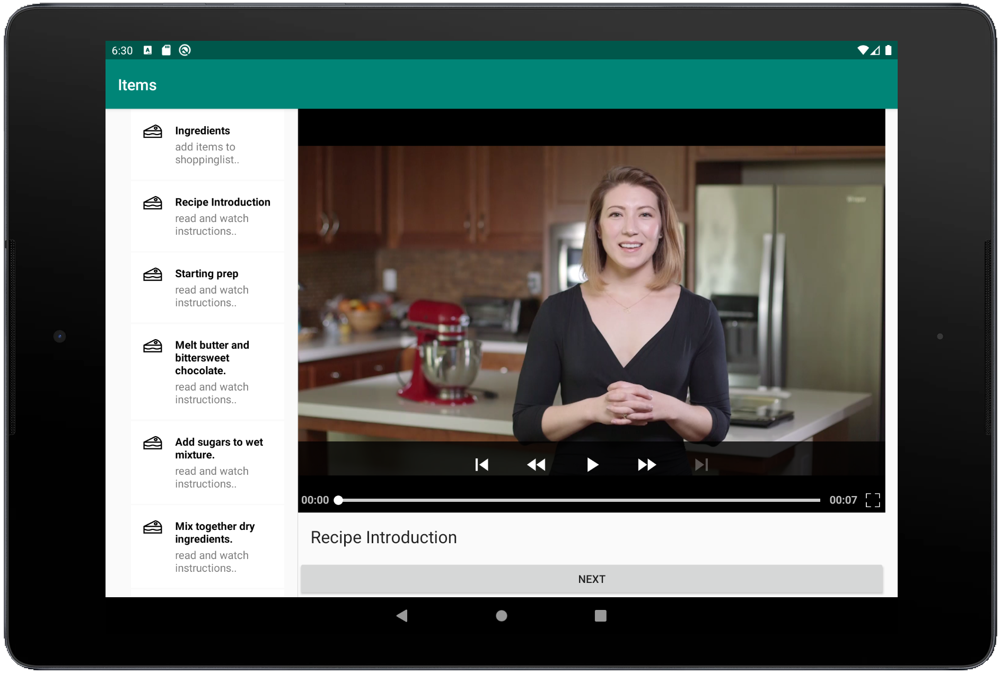
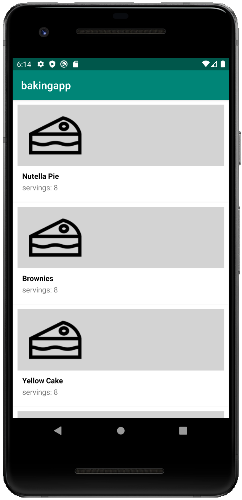
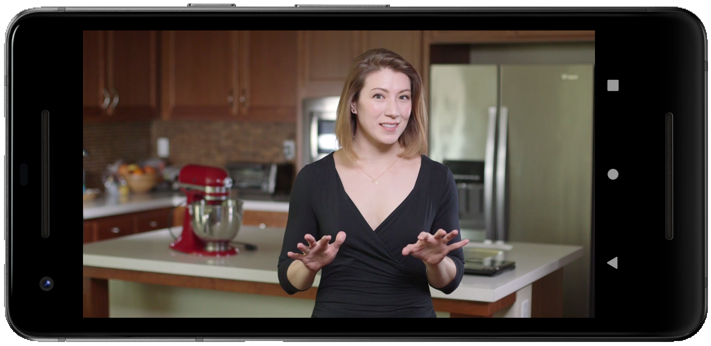

# Udacity - BackingApp

## Overview:
An Application has [jetpack](https://developer.android.com/jetpack), shows a [twopanelayout](https://www.techotopia.com/index.php/An_Android_Studio_Master/Detail_Flow_Tutorial) with [exoplayer](https://github.com/google/ExoPlayer) imlementation

 

## Join development!

**Build status:** master  stable 

**Start contributing:** Make sure you read [SETUP.md](https://github.com/owncloud/android/blob/master/SETUP.md) when you start working on this project. Basically: Fork this repository and contribute back using pull requests to the master branch.

**License:** [GPLv2](https://github.com/josefdeutsch/udacitybakingapp/blob/master/LICENSE.txt)
